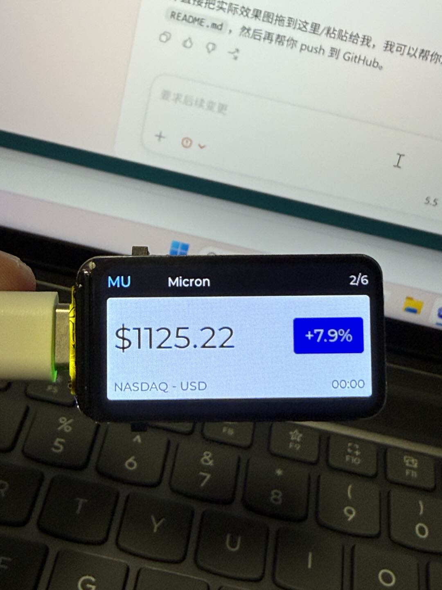

# ESP32-S3 LCD Stock Ticker

A compact US stock ticker for the Waveshare `ESP32-S3-LCD-1.47B` board.

It shows one market item at a time on the 1.47 inch LCD, supports button switching, four-page viewing, automatic symbol rotation, and either a local or cloud proxy for more stable updates.

## Current Release

This version adds a more product-like boot flow:

- 3 second boot splash screen
- WiFi bootstrap page during startup
- automatic connect across multiple saved WiFi networks
- automatic fallback to setup mode when WiFi cannot connect
- built-in hotspot + browser setup page for WiFi, stock, and FX configuration
- optional Stocks / FX display mode

## Demo



## Features

- Landscape stock card UI for the 1.47 inch LCD
- Two-page mode:
  - Page 1: quote, change percent, market, update time
  - Page 2: 30 day trend line
- Single click: next symbol
- Long press: previous symbol
- Double click: switch between quote page and 30D trend page
- Any button action pauses automatic symbol rotation for 30 seconds
- Automatic background refresh every 60 seconds
- Automatic symbol rotation every 12 seconds
- Keeps the last successful price on screen while refreshing
- Up = red box, red LED
- Down = green box, green LED
- WiFi fallback between multiple saved networks
- Boot splash screen and WiFi bootstrap UI
- Setup mode hotspot: `Reckton-Stock-Setup`
- Browser configuration page at `http://192.168.4.1`
- Configurable WiFi list, display mode, proxy URL, symbols, FX bases, brightness, refresh time, rotate time
- Local Node.js proxy for stable Finnhub access
- Cloudflare Worker proxy option so the ESP32 does not depend on your computer staying on
- Cloudflare custom domain support, for example `https://stock.your-domain.com`
- VPS HTTP proxy option for the best ESP32 compatibility
- Low-power defaults: RGB LED disabled and IMU powered down

## Current Symbols

Stocks mode:

- WDC
- MU
- AAPL
- NVDA
- AVGO
- TSM

FX mode:

- USD/CNY
- EUR/CNY
- GBP/CNY
- CAD/CNY

## Pages

The screen has two pages:

- P1 Price: quote, change percent, market, update time
- P2 30D Trend: recent 30 point history line with start, high, low, latest values

FX data is daily reference data from Frankfurter. It is useful for a desktop reference screen, not for trading-grade realtime FX.

## Hardware

- Waveshare ESP32-S3-LCD-1.47B
- 1.47 inch LCD
- 2 onboard buttons
- USB-C cable
- WiFi network

## Project Structure

- `LVGL_Arduino.ino`: Arduino entry file
- `AppConfig.cpp` / `AppConfig.h`: persistent runtime settings
- `SetupPortal.cpp` / `SetupPortal.h`: hotspot setup portal and save/reboot flow
- `LVGL_Example.cpp`: screen layout, page switching, button behavior
- `Stock.cpp` / `Stock.h`: quote refresh and stock data model
- `Secrets.example.h`: template for local WiFi and proxy settings
- `proxy/stock-proxy.js`: local Node.js proxy for Finnhub
- `proxy/start-stock-proxy.cmd`: one-click proxy launcher on Windows
- `proxy/cloudflare-worker/`: cloud relay version for public deployment
- `proxy/VPS-DEPLOY.md`: VPS deployment guide

## Why Use a Proxy

Direct HTTPS requests from the ESP32 were not stable enough during repeated refreshes.

Both proxy modes help by:

- requesting Finnhub outside the ESP32
- caching quote and company profile data
- giving the ESP32 a simpler local HTTP endpoint
- reducing network and memory pressure on the board

### Local Proxy

Use this if:

- you are testing on your own computer
- you want the quickest setup
- you do not mind keeping the computer running

### Cloud Proxy

Use this if:

- you do not want to keep your computer on
- you want the ESP32 to work anywhere with WiFi
- you want a public HTTPS endpoint

## Setup

### 1. Arduino IDE

- Install Arduino IDE
- Install the ESP32 board package
- Select board: `ESP32S3 Dev Module`
- Select a large partition scheme such as `Huge APP`

### 2. LVGL Font Settings

In your Arduino LVGL library `lv_conf.h`, enable these fonts:

```cpp
#define LV_FONT_MONTSERRAT_20 1
#define LV_FONT_MONTSERRAT_24 1
#define LV_FONT_MONTSERRAT_32 1
#define LV_FONT_MONTSERRAT_36 1
#define LV_FONT_MONTSERRAT_40 1
#define LV_FONT_MONTSERRAT_48 1
```

The project will automatically prefer larger fonts when they are enabled.

### 3. ESP32 Config

Copy:

```text
Secrets.example.h -> Secrets.h
```

Then edit `Secrets.h` and fill in:

- your WiFi credentials
- your proxy address

Examples:

- local proxy: `http://192.168.31.118:8787`
- cloud proxy via custom domain: `https://stock.your-domain.com`
- cloud proxy via workers.dev: `https://your-worker-name.your-subdomain.workers.dev`

### 4. Local Proxy Config

Copy:

```text
proxy/proxy-secrets.example.json -> proxy/proxy-secrets.json
```

Then edit `proxy/proxy-secrets.json` and fill in:

- your Finnhub API key
- host and port if needed
- refresh interval if needed

### 5. Start the Local Proxy

On Windows, double-click:

```text
proxy/start-stock-proxy.cmd
```

Default health check:

```text
http://127.0.0.1:8787/health
```

### 6. Cloudflare Worker Option

If you prefer a cloud relay instead of a local proxy, use:

[cloudflare-worker README](C:/Users/reckt/Documents/ESP32-weixue-1.4inch/official-demo/Arduino/examples/Stock_Ticker/LVGL_Arduino/proxy/cloudflare-worker/README.md)

### 7. Upload to the Board

Open:

[LVGL_Arduino.ino](C:/Users/reckt/Documents/ESP32-weixue-1.4inch/official-demo/Arduino/examples/Stock_Ticker/LVGL_Arduino/LVGL_Arduino.ino)

Then compile and upload from Arduino IDE.

## Quick Start

1. Copy `Secrets.example.h` to `Secrets.h`
2. Fill in WiFi and proxy address in `Secrets.h`
3. Choose one proxy mode:
   - local Node proxy
   - Cloudflare Worker
4. Fill in the matching proxy URL
5. Open `LVGL_Arduino.ino` in Arduino IDE
6. Upload to the board

## Boot Flow

After power-on the device now behaves like this:

1. Show boot splash for 3 seconds
2. Show WiFi bootstrap screen
3. Try saved WiFi credentials one by one
4. If WiFi connects:
   - sync time
   - enter stock page
5. If WiFi fails:
   - start hotspot `Reckton-Stock-Setup`
   - open setup UI on `http://192.168.4.1`

You can also long press the `BOOT` button while running to enter setup mode manually.

## Setup Mode

When setup mode starts:

- the board creates hotspot `Reckton-Stock-Setup`
- your phone or computer can connect to it
- open `http://192.168.4.1`
- save settings
- the board reboots automatically

The setup page currently supports:

- up to 3 saved WiFi networks
- proxy base URL
- stock symbols list
- refresh interval
- auto rotate interval
- display brightness

## Proxy API

The ESP32 reads data from:

```text
GET /quote?symbol=WDC
```

Example response:

```json
{
  "symbol": "WDC",
  "name": "W. Digital",
  "status": "NASDAQ - USD",
  "c": 61.23,
  "d": 0.74,
  "dp": 1.22,
  "updated_at": "21:34",
  "industry": "Technology",
  "country": "US",
  "ipo": "2015-05-06",
  "market_cap": "34.5B",
  "shares_out": "326M",
  "ready": true,
  "error": ""
}
```

## Notes

- `Secrets.h` is ignored by Git and should stay local
- `proxy/proxy-secrets.json` is ignored by Git and should stay local
- if the selected proxy is unavailable, the board keeps the last successful quote on screen
- if a refresh fails, the old price is not cleared
- for best ESP32 stability this project prefers HTTP from ESP32 to your proxy/custom domain

## Troubleshooting

### Build cache corruption

If Arduino shows errors such as:

- `file truncated`
- `archive is not an object`

delete:

```text
C:\Users\reckt\AppData\Local\arduino\sketches\
```

Then build again.

### Sketch too big

If you see `text section exceeds available space in board`, change the partition scheme to a larger app layout such as `Huge APP`.

### No stock data

Check these items:

- the proxy window is still running
- the ESP32 and your computer are on the same local network
- `STOCK_PROXY_BASE_URL` matches your computer IP and port
- your Finnhub API key is valid

If you are using the Cloudflare Worker instead of the local proxy, check:

- `https://your-domain-or-worker/health` opens in a browser
- `https://your-domain-or-worker/quote?symbol=AAPL` returns JSON
- `STOCK_PROXY_BASE_URL` exactly matches that HTTPS base URL

### WiFi connected but no updates

Open Arduino Serial Monitor at `115200` and check:

- WiFi connection logs
- stock request logs
- HTTP return codes

### Device enters setup mode on boot

This usually means:

- no saved WiFi is currently available
- saved password is wrong
- proxy URL is empty or invalid after reconfiguration

Connect to hotspot `Reckton-Stock-Setup` and open `http://192.168.4.1` to fix settings.

## Known Issues

- Direct HTTPS access from ESP32 to public stock APIs can still be fragile on small devices
- If you use the local proxy and the proxy computer is turned off, the board can only show the last cached quote

## Roadmap

- add configurable symbols from a simpler file
- add more screen styles
- show market open/close status
- support additional data sources

## License

Personal project for learning and experimentation.
